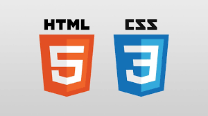
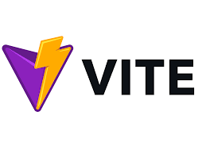

# Project 16: NewsExplorer

## Description

This project is a website designed to supply the user with the current news as it relates to whatever topic they search for. You are then allowed to choose which news articles you'd like to save to your personal profile. You are able to register and log in, but this project has no backend to store your information.

### Technologies Used

* HTML
* CSS
* JavaScript
* Flexbox
* React
* Vite
* Figma

---

 **HTML, CSS, Flexbox**

This project utilized HTML as well as CSS to style the elements.

 **JavaScript**

This project was made utilizing JavaScript. Several functions and variables were used to assist React in this project.

 **React**

This project was made utilizing React. Several functions and variables were used to execute actionable features. React was used to tap into a News API to collect that data, and use it make this website functional and adaptable.

 **Vite**

Vite was utilized to assist React and all of it's configurations.
  
 **Figma**

Figma is a web based program that allows coders and designers to interact with each other for the purposes of collaborating on a project together. You can find the link to the Figma project below.

* [Link to the project on Figma](https://www.figma.com/design/3ottwMEhlBt95Dbn8dw1NH/Your-Final-Project?node-id=22618-1233&t=zgmwNaeN8mY7r7oZ-0)

* [Link to the repository](https://github.com/TonyRiches17/se_project_final.git)
---
